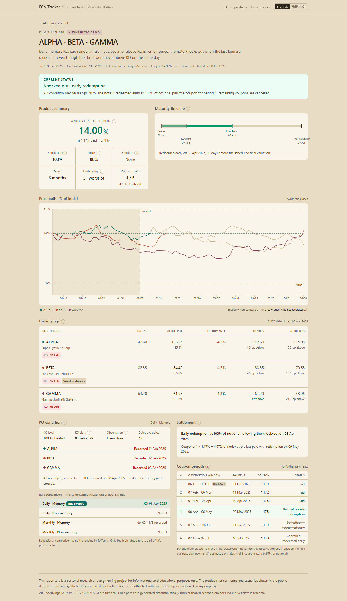
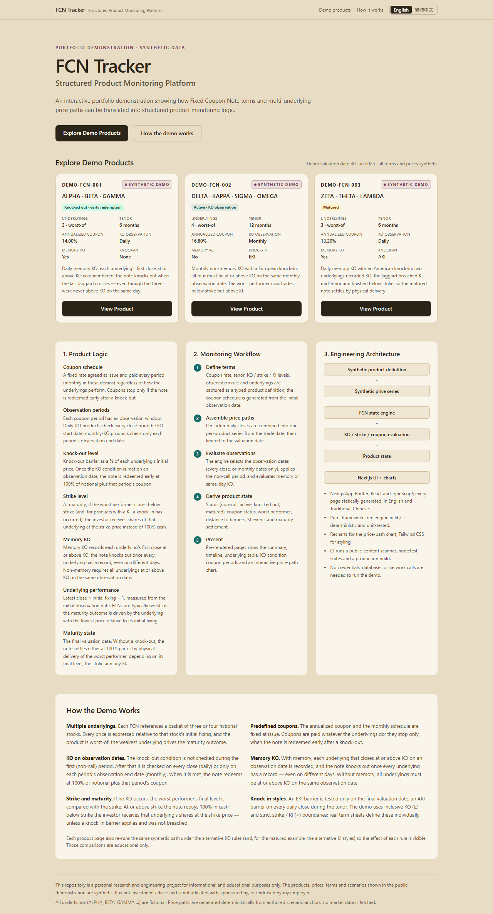
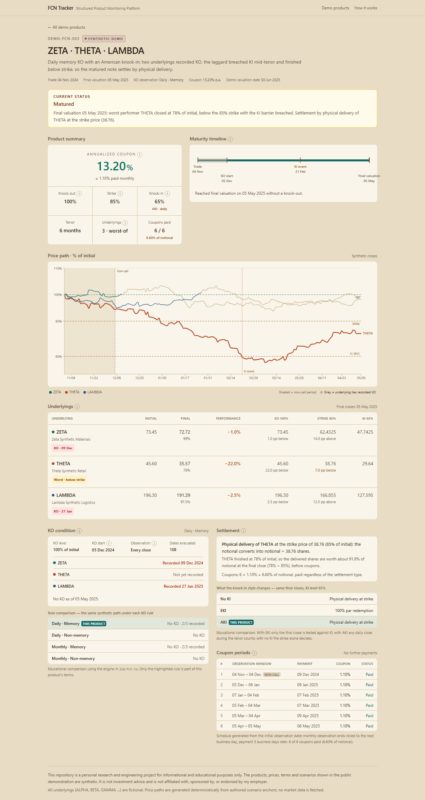
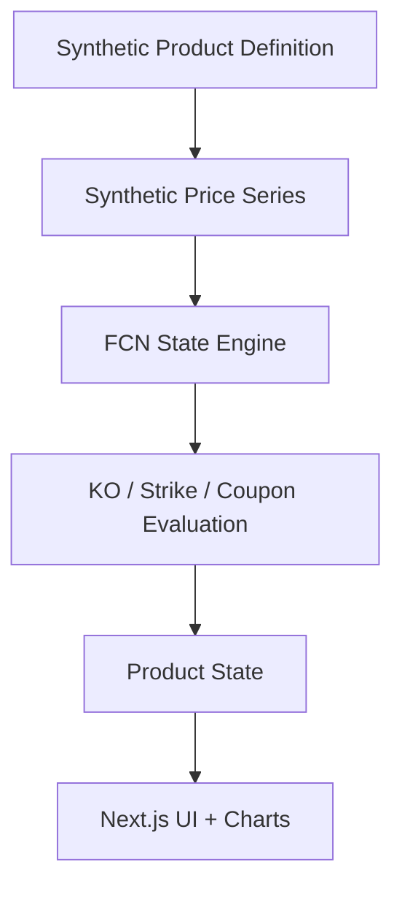

# FCN Tracker — Structured Product Monitoring Platform

[](https://github.com/TaylorYam/FCN-Tracker-Public/actions/workflows/ci.yml)

> **Synthetic demo.** Every product, underlying, date, price and term in this
> repository is fictional. This is not investment advice.

## Overview

FCN Tracker is a portfolio demonstration of a structured-product monitoring
workflow for **Fixed Coupon Notes (FCNs)**. It shows how product terms,
underlying price paths, observation periods, coupon schedules and knock-out
conditions can be translated into an interactive monitoring application.

This public edition is derived from a private project. It keeps the product
logic and application architecture, and replaces all operational data and
infrastructure with deterministic synthetic data, so it runs anywhere with no
credentials and no network access.



## What This Project Demonstrates

- **Structured-product domain modelling** — FCN terms, worst-of baskets,
  knock-out (KO), strike, knock-in (KI: none / European / American), non-call
  period, memory vs non-memory KO, daily vs monthly observation.
- **Lifecycle logic** — product status, KO trigger dates, coupon status after
  early redemption, KI events, and maturity settlement (par vs physical
  delivery at strike).
- **Monitoring UX** — status banner, maturity timeline, underlying table with
  distance to each barrier, KO-condition breakdown, coupon schedule, and a
  multi-underlying price-path chart with barrier lines.
- **Engineering** — Next.js App Router, React, TypeScript, a pure and
  deterministic engine, 100+ unit and scenario tests, CI with a
  public-content safety scanner.

## Live Demo

[Open the live FCN Tracker portfolio demo](https://fcn-tracker-portfolio.vercel.app)

The demo uses fully synthetic product terms and price paths and requires no
credentials or private infrastructure.

To run it locally:

```bash
npm ci
npm run build
npm start          # http://localhost:3000
```

Development server: `npm run dev`. Requirements: Node.js 20.9+ (CI uses the
current LTS, Node 24). No environment variables are needed.

| Landing page | Matured product with physical delivery (DEMO-FCN-003) |
|---|---|
|  |  |

## Structured Product Concepts

| Concept | How the demo models it |
|---|---|
| **Coupon schedule** | Fixed annualized rate, paid monthly. Schedule generated from the initial observation date; observation ends rolled to the next business day; payment 3 business days later. Coupons are paid regardless of performance and stop only after a KO. |
| **Observation periods** | Each coupon period has an observation window. Period 1 is the **non-call period**: KO is not observed. |
| **Knock-out level** | Barrier as % of each underlying's initial fixing (inclusive, ≥). Daily products check every close from the KO start date; monthly products check each period's observation end only. On KO the note redeems at 100% plus that period's coupon. |
| **Memory KO** | Each underlying's first close at or above KO is recorded; the note knocks out once every underlying has a record, even on different days. Non-memory requires all underlyings at or above KO on the same observation date. |
| **Strike level** | At maturity (no KO), if the downside is active and the worst performer finishes below strike, settlement is physical delivery of that underlying at the strike price; otherwise 100% par. |
| **Knock-in (KI)** | EKI: tested on the final close only. AKI: any daily close during the tenor. With KI, the downside is active only after a KI event. |
| **Underlying performance** | Close ÷ initial fixing − 1; distance to KO, strike and KI in percentage points; worst performer highlighted once below strike. |
| **Maturity state** | Non-call → KO observation → knocked out *or* matured (par / physical delivery). |

Boundary conventions (≥ for KO, < for strike and KI) are demo conventions;
real term sheets define them individually.

## Demo Products

Demo valuation date: **30 Jun 2025** (fixed, for reproducibility).

| Product | Underlyings | Tenor | Coupon p.a. | KO rule | Strike | KI | Status at demo date |
|---|---|---|---|---|---|---|---|
| **DEMO-FCN-001** | ALPHA · BETA · GAMMA | 6 M | 14.00% | 100%, daily, memory | 80% | none | Knocked out — the last laggard crossed KO; under non-memory rules the same path would not have knocked out |
| **DEMO-FCN-002** | DELTA · KAPPA · SIGMA · OMEGA | 12 M | 16.80% | 100%, monthly, non-memory | 75% | 60% EKI | Active — all four were above KO on a non-observation day only; worst performer below strike, above KI |
| **DEMO-FCN-003** | ZETA · THETA · LAMBDA | 6 M | 13.20% | 100%, daily, memory | 85% | 65% AKI | Matured — AKI breached, worst performer finished below strike → physical delivery (would have been par under EKI) |

Each product page also re-runs the same path under the alternative KO rules
(and, for the matured product, the alternative KI styles) as an educational
comparison.

## Architecture



```
app/                    Next.js routes (landing, /products/[productId])
components/             UI; product/PriceChart.tsx is the only browser-hydrated component
lib/fcn.ts              KO engine: observation dates, memory / non-memory
lib/ki.ts               knock-in events (EKI / AKI)
lib/lifecycle.ts        status, maturity settlement, next observation date
lib/coupons.ts          coupon amounts and status
lib/performance.ts      performance vs initial, worst-of
lib/schedule.ts         business-day and coupon-schedule helpers
lib/state.ts            assembles the ProductState
lib/market-data.ts      MarketDataSource boundary
lib/demo/               synthetic products, scenario anchors, seeded generator
__tests__/              node:test suites
scripts/check_public.py public-content safety scanner
```

Details, including how a production market-data layer would replace the
synthetic source: [docs/architecture.md](docs/architecture.md).

## Technology Stack

- **Next.js 15** (App Router, static generation) and **React 19**
- **TypeScript 5** (strict)
- **Tailwind CSS 3** (with PostCSS / Autoprefixer)
- **Recharts 3** for the price-path chart
- **Node.js** built-in test runner (`node:test`) with **tsx**
- **Python 3** (standard library only) for the public-content scanner
- **GitHub Actions** for CI

## Data Flow

1. `lib/demo/products.ts` defines the synthetic terms; the coupon schedule is
   generated from the initial observation date.
2. `lib/demo/paths.ts` holds a few anchor points per underlying;
   `lib/demo/synthetic.ts` fills the business days in between with a seeded
   Brownian bridge that passes exactly through each anchor.
3. `assembleProductSeries` combines per-ticker closes into one series per
   product; `buildProductState` clips it to the valuation date and runs the
   KO, KI, lifecycle, coupon and performance evaluators.
4. Pages are rendered at build time from the resulting `ProductState`.

## Testing

```bash
npm test            # node:test suites (115 tests)
npm run typecheck   # tsc --noEmit
npm run build       # production build
python scripts/check_public.py   # public-content scan
python -m unittest discover -s scripts -p "test_*.py"   # scanner self-tests
```

Coverage by area: daily and monthly KO evaluation, memory and non-memory KO,
non-call period, inclusive KO boundary, observation-date selection, coupon
schedule generation, strike threshold, worst-performer logic, EKI / AKI
knock-in detection, maturity settlement, lifecycle status, coupon status after
KO, state assembly, generator determinism, and scenario assertions for each
demo product.

## AI-Assisted Development Workflow

AI coding assistants were used as tools during development — for
implementation, refactoring, debugging, writing tests and drafting
documentation. This public edition was also prepared with AI assistance,
following a written safety specification.

Product logic, financial interpretation, architecture decisions, validation of
results and final review remain human-controlled. AI did not design the
financial product or decide how its terms should be interpreted; every rule in
the engine is covered by tests reviewed against the intended product
behaviour.

## Portfolio Safety

The public edition was built as a fresh repository from reviewed source files
only. It intentionally excludes:

- real product records, real product registry codes and real term sheets
- salesperson / user assignment data and the routes that used it
- the internal admin console and the chat-bot product-submission workflow
- production storage, scheduled data-ingestion jobs and deployment configuration
- credentials, environment files and logs
- the private repository's Git history

`scripts/check_public.py` runs in CI and fails the build on content that looks
like identifiers, credentials, personal data or private infrastructure. It
prints file paths and categories only, never matched values. Individual
reviewed lines are pinned in `scripts/public_scan_allowlist.json` by hash, so
any later edit to such a line requires a fresh review. See
[PUBLIC_READINESS_AUDIT.md](PUBLIC_READINESS_AUDIT.md).

## Limitations

- Business days are weekdays only; no holiday calendars.
- One KO level for the whole tenor (no step-down), monthly coupons only.
- KO and KI use daily closes; intraday observation is not modelled.
- Early redemption pays the KO period's coupon on that period's payment date
  (demo convention); accrued-coupon variants are not modelled.
- Physical-delivery value is indicative (final close ÷ strike); fractional
  shares, cash adjustments, fees and FX are not modelled.
- No live market data — the synthetic source is the only `MarketDataSource`.

## Disclaimer

This repository is a personal research and engineering project for
informational and educational purposes only. The products, prices, terms and
scenarios shown in the public demonstration are synthetic. It is not
investment advice and is not affiliated with, sponsored by, or endorsed by my
employer.
