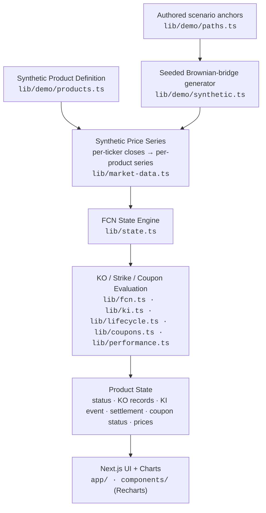

# Architecture

FCN Tracker is a statically generated Next.js application on top of a small,
framework-free TypeScript engine. The engine turns **product terms** plus a
**daily price series** into a **product state**; the UI only renders that state.

## Pipeline

| Stage | Module | Responsibility |
|---|---|---|
| Product definition | `lib/types.ts`, `lib/demo/products.ts` | Typed FCN terms. Coupon schedule generated by `buildMonthlyCouponSchedule` (`lib/schedule.ts`). |
| Price series | `lib/market-data.ts`, `lib/demo/*` | `MarketDataSource` interface; synthetic implementation; per-ticker closes assembled into one per-product series from the trade date. |
| State engine | `lib/state.ts` | Clips the series to `min(as-of, final valuation)`, runs every evaluator, returns one immutable `ProductState`. |
| KO evaluation | `lib/fcn.ts` | Observation-date selection (daily / monthly), non-call period, memory vs non-memory trigger. |
| KI evaluation | `lib/ki.ts` | AKI (any daily close) and EKI (final close only) knock-in events. |
| Lifecycle & settlement | `lib/lifecycle.ts` | Status (non-call, KO observation, knocked out, matured); worst-of maturity settlement (par vs physical delivery at strike). |
| Coupons | `lib/coupons.ts` | Per-period coupon, paid / scheduled / cancelled-after-KO status. |
| Performance | `lib/performance.ts`, `lib/ki-risk.ts` | Performance vs initial, distance to barriers, worst performer, KI proximity. |
| Rule comparison | `lib/rules.ts` | Re-evaluates the same path under alternative KO rules / KI styles (educational). |
| UI | `app/[locale]/`, `components/` | Server components render the state; only the chart and the language switcher are hydrated in the browser. |
| Localization | `lib/i18n/` | Locale config, path helpers and a typed EN / 繁中 dictionary; every locale must match the English shape at compile time. |

## Design choices

- **Deterministic.** The demo uses a fixed valuation date (`DEMO_AS_OF`) and a
  seeded generator, so every build, screenshot and test sees the same numbers.
- **Pure engine.** Everything in `lib/` is synchronous, side-effect free and
  framework independent — the same functions run in tests, at build time and
  in the browser.
- **Static output.** All pages are pre-rendered (`generateStaticParams`,
  `dynamicParams = false`); no runtime server state, credentials or network
  access are needed.
- **Localized, still static.** Each language is its own pre-rendered route
  (`/en/…`, `/zh-TW/…`) with the matching `<html lang>`. `/` redirects by
  remembered choice (cookie), then browser language, then English — a
  configuration redirect, not server code.
- **One boundary for data.** Market data enters only through
  `MarketDataSource`. The engine never knows whether closes are synthetic.

## Replacing synthetic data with a market-data layer (conceptual)

A production architecture can integrate an external market-data provider and
persistent storage. The portfolio edition uses deterministic synthetic data so
that the demonstration is reproducible and credential-free.

Conceptually, a live deployment would:

1. **Ingest** daily closes per ticker from a market-data provider on a schedule
   (after the relevant market close), with retries and back-off.
2. **Persist** closes per ticker (not per product), so products sharing an
   underlying reuse one series, and incremental fetches only add new dates.
3. **Serve** those closes through an asynchronous implementation of
   `MarketDataSource`.
4. **Render** product pages dynamically or with periodic revalidation instead
   of fully static generation, and surface data freshness ("closes as of …").
5. **Manage** product terms in a reviewed store rather than source files, with
   access control around any write path.

Steps 1–5 change only the data boundary and page rendering mode; the engine,
its tests and the UI components stay the same. None of that infrastructure is
included in this repository.

## Testing

`node:test` suites under `__tests__/` run directly against TypeScript via
`tsx`. They cover the KO engine (daily/monthly × memory/non-memory, non-call
period, boundary conditions), observation-date selection, schedule generation,
KI detection, maturity settlement, coupon status, worst-of logic, state
assembly, the synthetic generator, and scenario assertions that pin each demo
product's intended story.

## CI

`.github/workflows/ci.yml` runs on push, pull request and manual dispatch:
checkout → `npm ci` → public-content scan (`scripts/check_public.py`) → type
check → tests → production build. No credentials are required.
